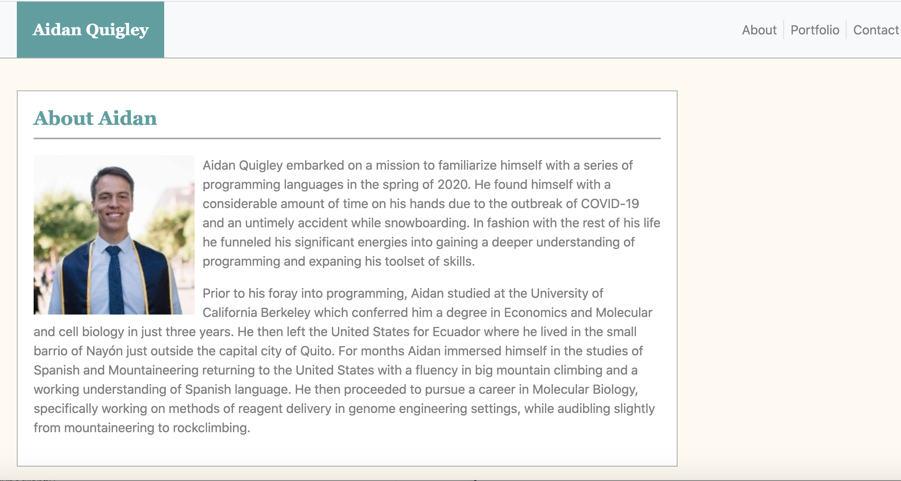
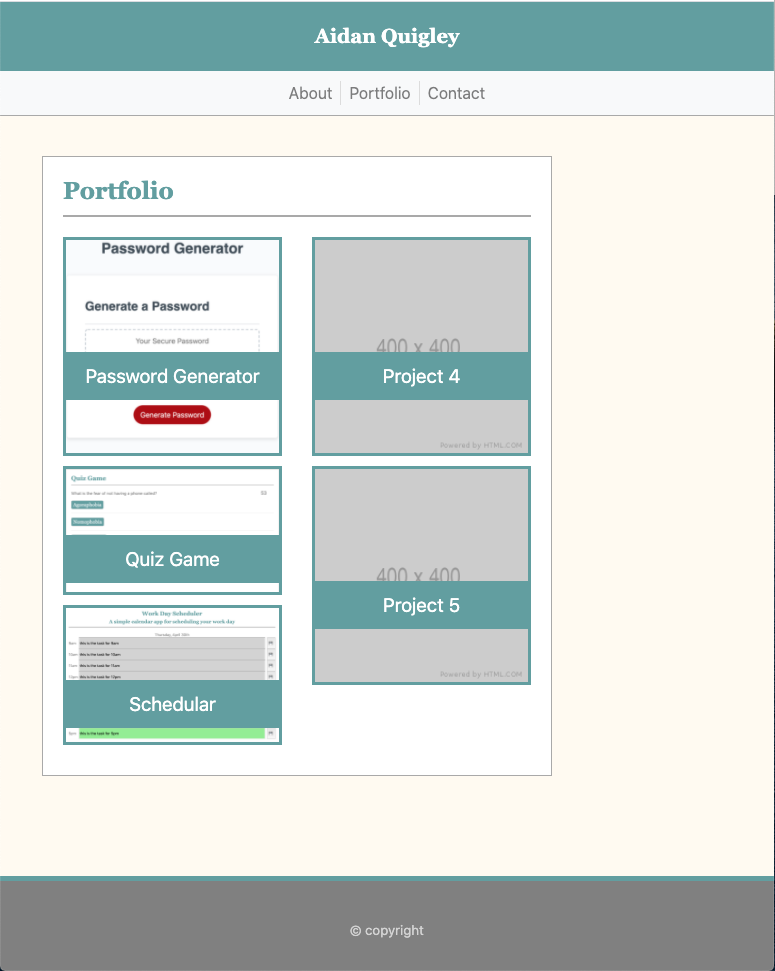

# Unit 02 CSS and Bootstrap Homework: Responsive Portfolio

The goal of this assignment was to build a simple website that incorporated a single HTML file for each webpage and a stylesheet that was used across those webpages. This was intended to be a personal website showcasing a portfolio of work that we would create over the coming months. The goal was to develop a framework which we could come back and add content to. 

To achieve this goal of developing a responsive website we incorporated bootstrap which allowed for a framework CSS on top of which we added our own CSS. This will permit scaling of the website should we so choose.

Included below are select images sample webpages at different screen sizes.

